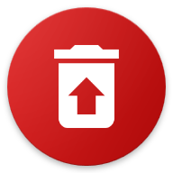

# Android-Optimization-Guide
[](https://opensource.org/licenses/MIT)[](https://github.com/ADeveloper16/Optimizing-Phone-Android-Only/commits)[](https://github.com/ADeveloper16/Optimizing-Phone-Android-Only/commits)

This repository contains Android optimization tips, performance tweaks, debloating recommendations, and lightweight app alternatives.

## 📋 Table of contents
1. [Enable Developer options](#enable-developer-options)
2. [Performance tweaks](#performance-tweaks)
3. [Debloat list](#debloat-list)
4. [Recommended apps to use](#recommended-apps-to-use)
5. [Credits](#credits---app-developers)
6. [On Linux debloat tutorial](#linux-os-tutorial-adb)

---

## Enable Developer options

Before starting let's enable Android Developer options.

### 📱 On Samsung

⚙ Before we begin you'll need to enable Developer options.

1. Open **Settings**.

2. Tap **About phone**.

3. Tap **Software information**.

4. Tap **Build number** seven times.

5. If prompted, enter your screen lock.

6. A message will appear confirming that Developer options have been enabled.

7. Return to the main  **Settings** menu.

8. Tap **Developer options**.

---

## Performance tweaks
---

### Logger buffer sizes

Let's start by changing **Logger buffer sizes**.

⚠ **WARNING**: Changing developer options may affect your device's behavior. Proceed only if you're comfortable making these changes.

**Watch the video below for a tutorial**.

[](https://www.youtube.com/shorts/sFqN02OOgU4)

Once you've finished, log recording will be disabled. On some devices, this may reduce background logging, although any performance impact can vary.
---
### System tracing

**Watch the video below for a tutorial**.

[](https://youtube.com/shorts/zEo_5j1Mnyw)
---
### Suspend Execution for Cached Apps

Let's enable **Suspend Execution for Cached Apps** After enabling this option, device may need to restart. to apply the change.

This setting allows Android to pause cached apps when they are not being used. The effect on performance can vary depending on your device and usage.

**Watch the video below for a tutorial**.

[](https://youtube.com/shorts/O2BOmCmVk64)
---
### Shizuku Setup

Now that were finished here, we'll continue with Shizuku. Shizuku allows you to debloat system apps without rooting your device. You can download it from [Shizuku](https://github.com/RikkaApps/Shizuku/releases/tag/v13.6.0) . It requires ADB setup on your computer but it's worth it for advanced debloating **Find Tutorial On YouTube For Detailed Steps**.

---

## Debloat list
| Category | Apps |
| :--- | :--- |
| **Samsung Bloat** | Bixby, Voice Wake Up, Customisation Service, Galaxy Avatar, Samsung Kids, Samsung News, Smart Switch |
| **Google/Meta** | Chrome, Gmail, Maps, Meet, Meta App Installer, Meta App Manager, Meta Services |
| **Microsoft** | Microsoft Swiftkey Factory Settings, Microsoft Swiftkey, OneDrive |
| **System/Other** | Link To Windows, Speech Synthesis, WiFi Tips |

To debloat apps i suggest you [Canta](https://github.com/samolego/Canta/releases/tag/v3.2.2) .


If you have computer you can try ADB step by step **Linux OS**

### Linux OS Tutorial Adb

1.Firstly lets download android platform tools from your terminal copy this text paste it on terminal
```bash
sudo apt install adb
```
2.Connect your device to laptop or PC and type this exactly in your terminal
```bash
adb devices
```
3.If it doesnt show up make sure you enabled USB Debugging on developer options

If it shows up your phone ID type this command 
```bash
adb shell pm disable-user --user 0 *package.name.here*
```
4.If you dont know what is the package name type
```bash
adb shell pm list | grep "*example: bixby,samsung,google,meta,facebook,windows*"
```

After reviewing the list, you can remove any apps you don't use.

⚠ Only remove apps you don't use. Some apps may be required for certain features.

After debloating unused apps, consider replacing them with lightweight open-source alternatives.

---

## Recommended apps to use

1. * **[Sterna Mail](https://f-droid.org/packages/app.sterna)**  - A lightweight email app designed with a no bloat. It uses Material Design You (MDY) and focuses on low usage. while it can be a bit hard to setting it up
2. * **[Easy Notes](https://f-droid.org/packages/com.kin.easynotes)**  - A Simple lightweight notes app no bloat and easy to use, with Material Design You.
3. * **[Translator](https://f-droid.org/packages/dev.davidv.translator)**  - An offline translator app that works without an internet connection. Useful for translating text when network access is unavailable
4. * **[Cromite](https://github.com/uazo/cromite/releases/tag/v153.0.8010.37-11507ac1061b5ea227806f5e84db5a57df6ccf6a)**  - A privacy-focused browser based on chromium. It includes built-in ad blocking, privacy improvements, and a clean browsing experience while keeping compatibility with modern websites.
5. * **[Booming Music](https://f-droid.org/packages/com.mardous.booming)**  - A Music player that has really useful features while keeping size ideal.
6. * **[PassVault](https://f-droid.org/packages/com.jksalcedo.passvault)**  - Ever bored about normal autofill's like Google Autofill Service and Samsung Pass? well this app brings better Password management on Browser's and supports JSON, CSV, KDBX.
---
## Credits - App Developers
Special thanks to the developers who created these apps. All credit goes to their respective creators.
---
